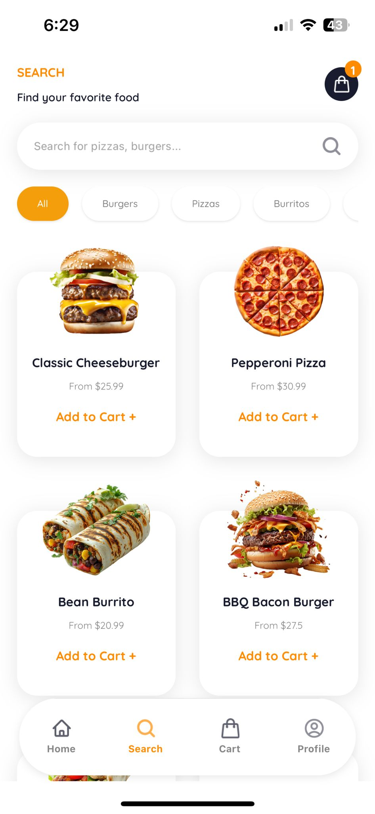
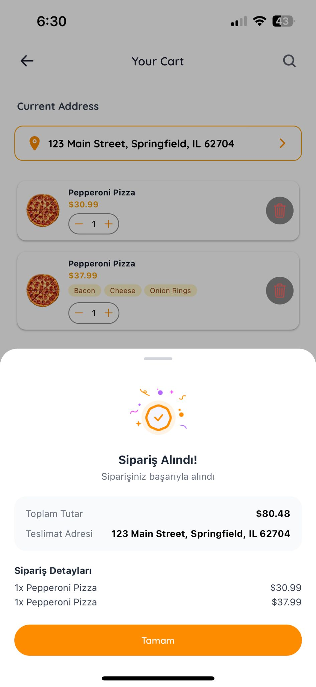
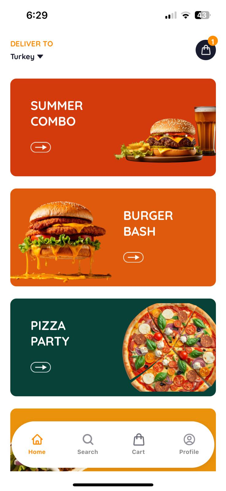
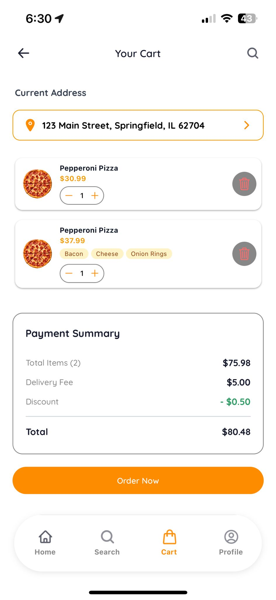
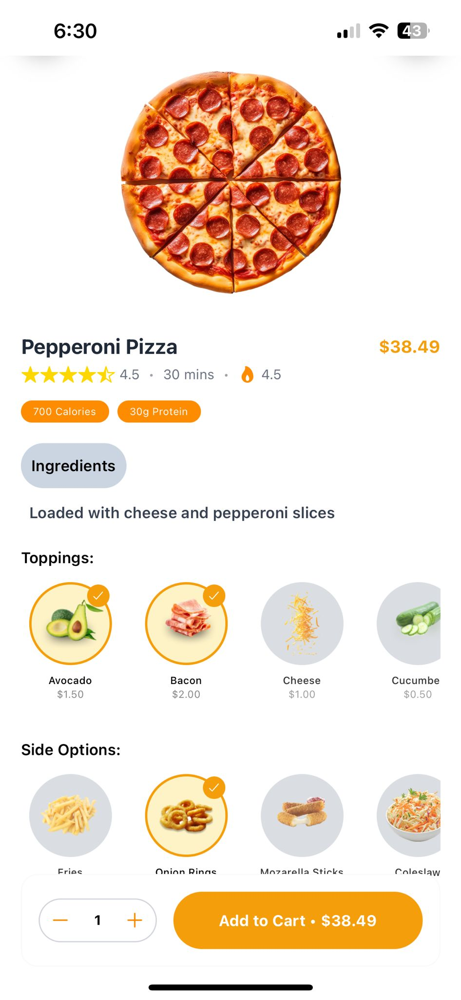
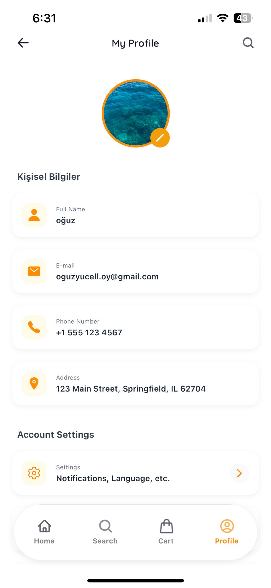
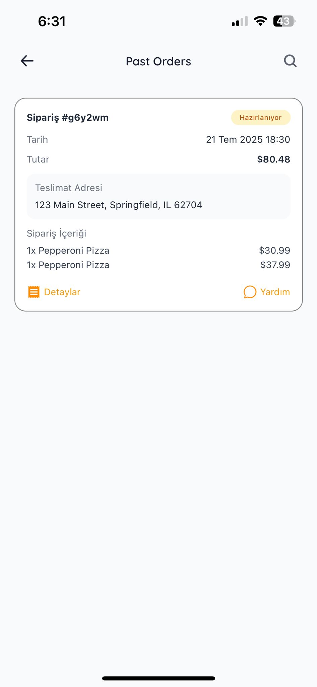
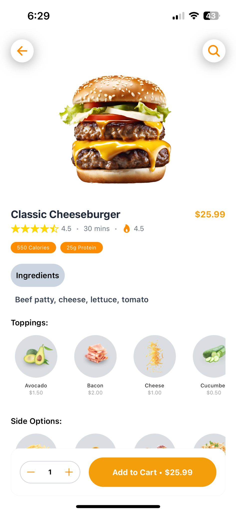

# 🍕 Food Ordering App - React Native

[](https://reactnative.dev/)
[](https://expo.dev/)
[](https://www.typescriptlang.org/)
[](https://appwrite.io/)
[](https://tailwindcss.com/)

[](LICENSE)
[](https://reactnative.dev/)
[](https://github.com/yourusername/food-app-react-native/releases)

[](https://sentry.io/)
[](https://github.com/pmndrs/zustand)
[](https://expo.github.io/router/)

A modern, feature-rich food ordering application built with React Native, Expo, and Appwrite backend. This app provides a seamless experience for users to browse food items, place orders, and manage their profiles.

## 📱 Screenshots

<p align="center">
  
  
  
  
  
  
  
  

</p>


## ✨ Features

### 🔐 Authentication

- User registration and login with email validation
- Secure authentication with Appwrite backend
- Session management with Zustand store
- Auto-redirect based on authentication state

### 🏠 Home & Browse

- Dynamic food categories display
- Restaurant listings with ratings
- Search functionality
- Featured items carousel
- Real-time data updates

### 📦 Order Management

- Add items to cart
- Order history tracking (`/pastOrders`)
- Real-time order status updates
- Payment integration ready

### 👤 Profile Management

- User profile with editable information
- Profile picture upload and management with Appwrite Storage
- Personal information management (name, email, phone, address)
- Pull-to-refresh functionality
- Account settings

### 🎨 UI/UX

- Modern, clean design with Tailwind CSS (NativeWind)
- Custom Quicksand font family integration
- Smooth animations and transitions
- Loading states and error handling
- Responsive design for all screen sizes

## 🚀 Tech Stack

### Frontend

- **React Native** - Cross-platform mobile development
- **Expo SDK 51** - Development platform and tooling
- **TypeScript** - Type safety and better development experience
- **NativeWind** - Tailwind CSS for React Native
- **Expo Router** - File-based routing system
- **Zustand** - Lightweight state management
- **Expo Image Picker** - Image selection and camera access
- **React Native Safe Area Context** - Handle device safe areas

### Backend

- **Appwrite** - Backend-as-a-Service
  - Authentication (Email/Password)
  - Database (NoSQL collections)
  - Storage (File uploads for profile images)
  - Real-time subscriptions

### Development Tools

- **Sentry** - Error tracking and performance monitoring with session replay
- **ESLint** - Code linting
- **TypeScript** - Static type checking
- **Custom Fonts** - Quicksand font family

## 📁 Project Structure

```
food-app-react-native/
├── app/                         # App screens and navigation
│   ├── (auth)/                  # Authentication screens
│   │   ├── sign-in.tsx          # Login screen
│   │   └── sign-up.tsx          # Registration screen
│   ├── (tabs)/                  # Tab navigation screens
│   │   ├── home.tsx             # Home/feed screen
│   │   ├── profile.tsx          # User profile screen
│   │   └── _layout.tsx          # Tab layout configuration
│   ├── (pages)
│   │   ├── pastOrders.tsx       # Order history screen
│   │   └── MenuItemDetails.tsx  # Product Deatils screen
│   ├── _layout.tsx              # Root layout with fonts & Sentry
│   └── globals.css              # Global Tailwind styles
├── components/                  # Reusable components
│   ├── CustomHeader.tsx         # Custom header component
│   └── ...                      # Other UI components
├── lib/                         # Utility functions and configs
│   ├── appwrite.ts              # Appwrite configuration & functions
│   └── ...                      # Other utilities
├── store/                       # State management
│   ├── auth.store.ts            # Authentication state with Zustand
│   └── ...                      # Other stores
├── assets/                      # Images, fonts, and other assets
│   ├── fonts/                   # Custom font files
│   │   ├── Quicksand-Bold.ttf
│   │   ├── Quicksand-Medium.ttf
│   │   ├── Quicksand-Regular.ttf
│   │   ├── Quicksand-SemiBold.ttf
│   │   └── Quicksand-Light.ttf
│   ├── images/                  # App images and icons
│   │   └── splash-icon.png      # Splash screen icon
│   └── ...
├── type.d.ts                    # TypeScript type definitions
├── app.json                     # Expo configuration
└── README.md                    # Project documentation
```

## 🛠️ Get started

### Prerequisites

- Node.js (v18 or higher)
- npm or yarn
- Expo CLI (`npm install -g @expo/cli`)
- Appwrite account and project

### 1. Clone the Repository

```bash
git clone https://github.com/yourusername/food-app-react-native.git
cd food-app-react-native
```

### 2. Install dependencies

```bash
npm install
```

### 3. Configure Appwrite

1. Create an account at [Appwrite Cloud](https://cloud.appwrite.io) or set up self-hosted Appwrite
2. Create a new project
3. Create a database with the following collections:

#### Users Collection

```typescript
{
  name: string;
  email: string;
  phone?: string;
  address?: string;
  avatar?: string;
  profileImageId?: string;
  profileImageUrl?: string;
  accountId: string;
}
```

4. Create a storage bucket for profile images with these settings:
   - Allowed file extensions: `.jpg`, `.jpeg`, `.png`, `.gif`, `.webp`
   - Maximum file size: 10MB
   - Permissions: `role:all` for read/write (adjust for production)

5. Set up authentication providers (Email/Password)

### 4. Environment Configuration

Update the `appwrite.ts` file in the `lib` directory with your Appwrite credentials:

```typescript
export const appwriteConfig = {
  endpoint: "https://cloud.appwrite.io/v1", // Your Appwrite endpoint
  projectId: "your-project-id",
  databaseId: "your-database-id",
  userCollectionId: "your-users-collection-id",
  bucketId: "your-storage-bucket-id",
  platform: "com.yourcompany.foodapp",
};
```

### 5. Start the app

```bash
npx expo start
```

In the output, you'll find options to open the app in a

- [development build](https://docs.expo.dev/develop/development-builds/introduction/)
- [Android emulator](https://docs.expo.dev/workflow/android-studio-emulator/)
- [iOS simulator](https://docs.expo.dev/workflow/ios-simulator/)
- [Expo Go](https://expo.dev/go), a limited sandbox for trying out app development with Expo

You can start developing by editing the files inside the **app** directory. This project uses [file-based routing](https://docs.expo.dev/router/introduction).

## 🔧 Key Features Implementation

### Authentication Flow

- Secure login/register with email validation
- Persistent sessions using Zustand store
- Auto-redirect based on authentication state
- Protected routes with authentication guards

### Profile Management

- Real-time profile updates with Appwrite
- Image upload with Expo Image Picker
- Pull-to-refresh functionality
- Optimistic UI updates
- Error handling and loading states

### State Management

- Zustand for lightweight global state
- Persistent authentication state
- Real-time data synchronization
- Type-safe store implementation

### Image Upload System

```typescript
// Example usage
const uploadResult = await uploadProfileImage(imageUri, userId);
const imageUrl = getFilePreview(fileId);
```

## 🎨 Styling

This project uses NativeWind (Tailwind CSS for React Native) for styling:

```tsx
// Example usage
<View className="flex-1 bg-white p-4">
  <Text className="text-2xl font-bold text-gray-800 font-quicksand-bold">
    Welcome to Food App
  </Text>
</View>
```

### Custom Fonts

The app includes Quicksand font family:

- `font-quicksand-light`
- `font-quicksand-regular`
- `font-quicksand-medium`
- `font-quicksand-semibold`
- `font-quicksand-bold`

## 📊 Monitoring & Analytics

### Sentry Integration

- Real-time error tracking and performance monitoring
- Session replay for debugging (10% sample rate)
- User feedback collection
- Mobile-specific error handling

### Usage Examples

```typescript
import * as Sentry from "@sentry/react-native";

// Track errors
Sentry.captureException(new Error("Something went wrong"));

// Track custom events
Sentry.addBreadcrumb({
  message: "User uploaded profile image",
  level: "info",
});
```

---

## 📄 License

This project is licensed under the MIT License - see the LICENSE file for details.


---


**Made with ❤️ and ☕ using React Native by Oğuz Yücel.**
